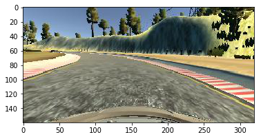
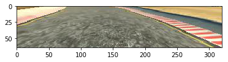
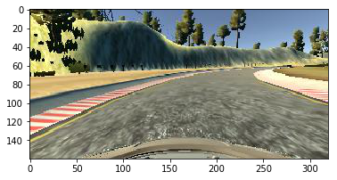
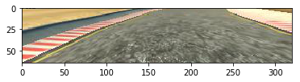

# **Behavioral Cloning** 

---

**Behavioral Cloning Project**

The goals / steps of this project are the following:
* Use the simulator to collect data of good driving behavior
* Build, a convolution neural network in Keras that predicts steering angles from images
* Train and validate the model with a training and validation set
* Test that the model successfully drives around track one without leaving the road
* Summarize the results with a written report


[//]: # (Image References)

[image1]: ./examples/placeholder.png "Model Visualization"
[image2]: ./examples/placeholder.png "Grayscaling"
[image3]: ./examples/placeholder_small.png "Recovery Image"
[image4]: ./examples/placeholder_small.png "Recovery Image"
[image5]: ./examples/placeholder_small.png "Recovery Image"
[image6]: ./examples/placeholder_small.png "Normal Image"
[image7]: ./examples/placeholder_small.png "Flipped Image"

## Rubric Points
### Here I will consider the [rubric points](https://review.udacity.com/#!/rubrics/432/view) individually and describe how I addressed each point in my implementation.  

---
### Files Submitted & Code Quality

#### 1. Submission includes all required files and can be used to run the simulator in autonomous mode

My project includes the following files:
* model.py containing the script to create and train the model
* drive.py for driving the car in autonomous mode
* model.h5 containing a trained convolution neural network 
* this `README.md` summarizing the results

#### 2. Submission includes functional code
Using the Udacity provided simulator and my drive.py file, the car can be driven autonomously around the track by executing 
```sh
python drive.py model.h5
```

#### 3. Submission code is usable and readable

The model.py file contains the code for training and saving the convolution neural network. The file shows the pipeline I used for training and validating the model, and it contains comments to explain how the code works.

### Model Architecture and Training Strategy

#### 1. An appropriate model architecture has been employed
My model is made up of cropping, regularization, convolution and dense layers.
In my code in `model.py` this can be found in lines 51-69. The first layer crops the image from 160x320 to
75x320 by cropping 70 pixels from the top of the image and 25 pixels from the bottom of the image (line 54).
After this, the regularization is added with a lambda function to help the model train faster (line 55).
Then, the convolutional layers are added they are built up as follows:

| Line         		    |     Description	        					|
|:---------------------:|:---------------------------------------------:|
| 58         	    	| 24 filters, kernel size 5, strides 2x2	|
| 59        	    	| 36 filters, kernel size 5, strides 2x2	|
| 60         	    	| 48 filters, kernel size 5, strides 2x2	|
| 61         	    	| 64 filters, kernel size 3                 |
| 62         	    	| 64 filters, kernel size 3                 |

All convolutional layers use relu as the activation function.

The result is flattened for improved performance, then 4 dense layers are added with respectively 100, 50,
 10 and 1 nodes.

#### 2. Attempts to reduce overfitting in the model

To prevent overfitting, I collected a fairly large amount of data, as well as using the provided sample data.
The total number of images before augmentation was around 70.000.
I used l/r augmentation by flipping the image and adding the negative of the original steering angle to the set.
This effectively doubled the number of images available for the model.
#### 3. Model parameter tuning

The model used an adam optimizer, so the learning rate was not tuned manually (model.py line 71).

#### 4. Appropriate training data

Training data was chosen to keep the vehicle driving on the road. I used a combination of center lane driving, recovering from the left and right sides of the road and finally some extra data on specific parts of the track.

The dirt road seemed to be a problem for the model, for this reason I added extra data to cover this specific part of the track.

### Model Architecture and Training Strategy

#### 1. Solution Design Approach and data gathering

I have tried many, many model architectures, and ended up with the one very close to the NVidia model.

Starting off with a linear model (as presented in the videos) to see if everything was working as supposed,
it wasn't good enough to make the entire lap. After this I started collecting more data and making the model more complex by adding more layers.

It wasn't driving very well, and it didn't seem to be overfitting as the validation loss was lower than the training loss on almost every run.

I attempted to collect more data on the tricky parts for a while, but this did not appear to be the solution, as after quite some extra data gathering and training, the solution was still not found.

I also tried adjusting the correction factor for the left and right images, trying 0.1, 0.15, 0.2 and 0.3.
This did not seem to have that much of an impact,
 but in the end I went with 0.2 as the last run with that value was still the best on the real track.

I finally took a look at other models (mainly the NVidia end-to-end driving model), and incorporated some of their changes.

Removing the pooling layers and instead increasing the strides of the conv layers from 1x1 to 2x2 seemed to have the largest impact for the better.
With this model I was finally able to create a model that could drive a full lap without going off track.

#### 2. Final Model Architecture

My final model is actually the model described above.

#### 3. Training Set & Training Process
I tried my best to drive in the center of the road, however I only had a touch pad available which made the steering a little tricky to get used to.
I did however use all data I recorded, so part of the model's bad driving may be attributed to my own bad driving.

Different categories in recording training data are: sample, regular lap, counter clockwise lap, corners, recoveries, dirt on the side/partial boundaries.

Data augmentation was used in the form of flipping over the vertical axis (as described earlier)

Below are examples of the images used in training.

Example of original image:



Example of original image after cropping:



Example of flipped image:



Example of flipped image after cropping:




I used all the left and right images provided by training with a correction factor of 0.2.

I used a 80/20 split for the training and validation set. For each epoch, all the data is shuffled (line 85).

